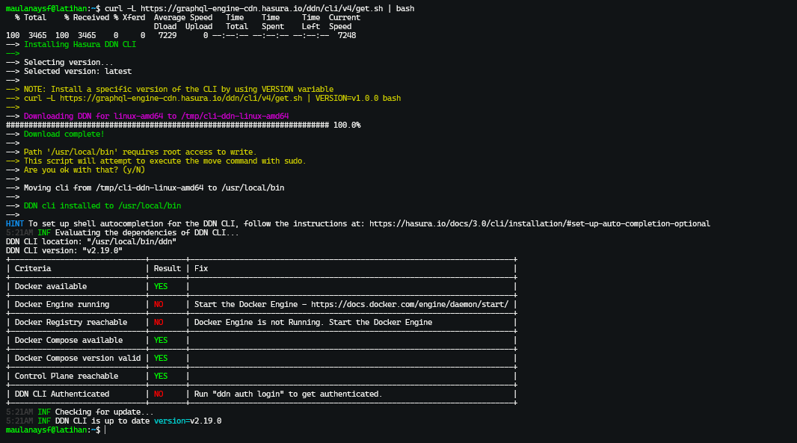
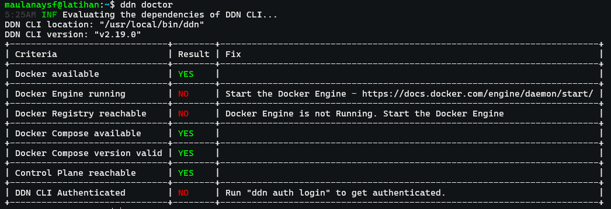

## Install Docker

> Update Apt

`sudo apt update`

> Install Dependency Untuk Docker

`sudo apt install -y apt-transport-https ca-certificates curl software-properties-common`

> Tambahkan GPG Key

`curl -fsSL https://download.docker.com/linux/ubuntu/gpg | sudo gpg --dearmor -o /usr/share/keyrings/docker-archive-keyring.gpg`

> Tambahkan Repository Docker

`echo "deb [arch=$(dpkg --print-architecture) signed-by=/usr/share/keyrings/docker-archive-keyring.gpg] https://download.docker.com/linux/ubuntu $(lsb_release -cs) stable" | sudo tee /etc/apt/sources.list.d/docker.list > /dev/null`

> Update Daftar Paket

`sudo apt update`

> Instal Docker Engine

`sudo apt install -y docker-ce docker-ce-cli containerd.io`

> Verivikasi Installasi

`docker --version`

## Install Docker Compose

> Update Apt

`sudo apt update`

> Install Docker Compose dengan CURL

`sudo curl -L "https://github.com/docker/compose/releases/download/v2.20.2/docker-compose-$(uname -s)-$(uname -m)" -o /usr/local/bin/docker-compose`

> Berikan Izin Eksekusi pada file tempat menyimpan docker compose

`sudo chmod +x /usr/local/bin/docker-compose`

> Verivikasi Installasi

`docker-compose --version`

> Tambahkan ke Path

`sudo ln -s /usr/local/bin/docker-compose /usr/bin/docker-compose`

## Install DDN CLI

> sumber: https://hasura.io/docs/3.0/getting-started/quickstart

masuk kedalam terminal server terlebih dahulu

> jalankan script installasi dari DDN CLI

`curl -L https://graphql-engine-cdn.hasura.io/ddn/cli/v4/get.sh | bash`

hasilnya:

> Verivikasi Installasi

`ddn doctor`

Hasilnya:

## Login kedalam DDN CLI untuk masuk Hasura DDN

> perintah login

`ddn auth login`

> setelah berhasil akan diarahkan ke URL untuk verifikasi akun hasura di browser.

> jika pada virtual box menggunakan jaringan NAT tambahkan rule yaitu Name:

- DDN Login
- Protocol: TCP
- Host IP: (Biarkan kosong atau isi 127.0.0.1).
- Host Port: 36319
- Guest IP: (Biarkan kosong).
- Guest Port: 36319

> lalu akses link yang diberikan oleh di terminal

hasilnya:

## Inisialisasi Supergraf Baru di Direktori Baru
